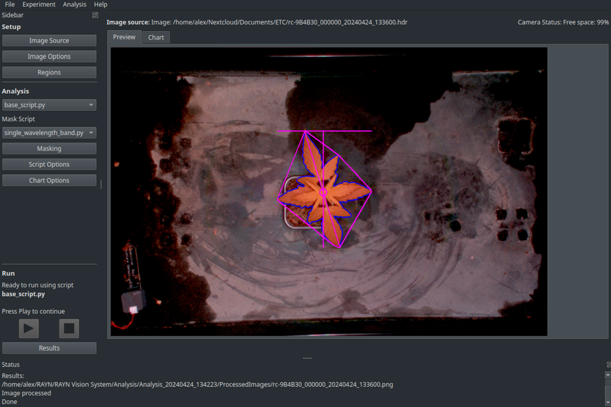

# RAYN Vision System Analytics



## Description
RAYN Vision System (RVS) Analytics is an open-source application for the processing
and analysis of hyper- and multispectral images from multiple sources, including RVS Cameras
online in the same network. It is based on [PlantCV](https://github.com/danforthcenter/plantcv),
an open-source image analysis software package targeted for plant phenotyping.

## Usage
Analyse hyper/multispectral images using PlantCV workflows in a graphical user interface. The application
provides different dialogues to e.g. select image source, regions of interest as well as masks 
in a graphical user interface.

Please refer to the User Guide for more details. You can download it through the 
[RVS-A webpage (Resources)](https://rayngrowingsystems.com/products/rvs-analytics/).

## Main Features

**Open Source** - Built on the PlantCV library for plant phenotyping.\
**Versatile Data Sources** - Supports multiple hyper- and multispectral image sources.\
**User-Friendly Interface** - Easily set regions of interest (ROIs). \
**Interactive Masking** - Select masking methods and thresholds with ease. \
**Base Analysis Script** - Analyze shape, size parameters, and selected reflectance indices. \
**Customizable** - Add your own analysis scripts. \
**Preview Data Visualization** - Quickly preview output.

For all spectral indices available for analysis, see [this document](https://github.com/rayngrowingsystems/RVS_Analytics/blob/main/spectral_index.md).

## Setup
### Windows installer
RAYN provides an executable to install RVS-A on Windows. You can download it through the 
[RVS-A webpage (Resources)](https://rayngrowingsystems.com/products/rvs-analytics/).

### Source Setup (any platform)

It is recommended to run the application in a virtual environment.
Required libraries and versions:
- python (3.11)
- plantCV 
- stackprinter
- paho-mqtt
- plotly
- watchdog
- kaleido (0.1.0.post1 for Windows/Linux, other versions do not work)
- pyside6
- requests

Here are the steps to set up everything to run the application. Note: You have to have python already installed!

```bash
pip install plantcv plotly stackprinter paho-mqtt watchdog pyside6 requests
pip install kaleido==0.1.0.post1
```
You can run the application from the repository with the following command:
```bash
cd PATH/TO/REPOSITORY # navigate to the repository
cd Application # enter Application folder - important for relative paths
python cameraapp.py
```

If installed from source, the application itself does not contain any analysis scripts. Mask and Analysis scripts can 
be added through the "Masks" and "Scripts" folders. You can use pre-made scripts or create your own. 

Both official RAYN and community-created scripts can be retrieved from the following repositories:
- [RVS-A Mask Scripts](https://github.com/rayngrowingsystems/RVS-A_analysis_scripts)
- [RVS-A Analysis Scripts](https://github.com/rayngrowingsystems/RVS-A_analysis_scripts)

Read here about how to create custom scripts:
- [RVS-A Custom Scripts](https://github.com/rayngrowingsystems/RVS-A_custom_scripts)

## Support
If you experience any problems or have feedback on the analysis scripts, please add an issue to this repository or 
contact [RAYN Vision Support](mailto:RAYNVisionSupport@rayngrowingsystems.com).

## Contributing
Whether it's fixing bugs, adding functionality to existing features or adding entirely new features, we welcome 
contributions.

Please add any suggestions/issues/bugs as issues in the [RVS Analytics Repository](https://github.com/rayngrowingsystems/RVS_Analytics/issues).

## License and Copyright
© 2024 ETC Inc d/b/a RAYN Growing Systems. Licensed under the Apache License, Version 2.0
You may not use the files in this repository except in compliance with the License.

Trademark and patent info: [rayngrowingsystems.com/ip](https://rayngrowingsystems.com/ip/) \
Third-party license agreement info: [etcconnect.com/licenses](https://www.etcconnect.com/licenses/). \
Product and specifications subject to change.

